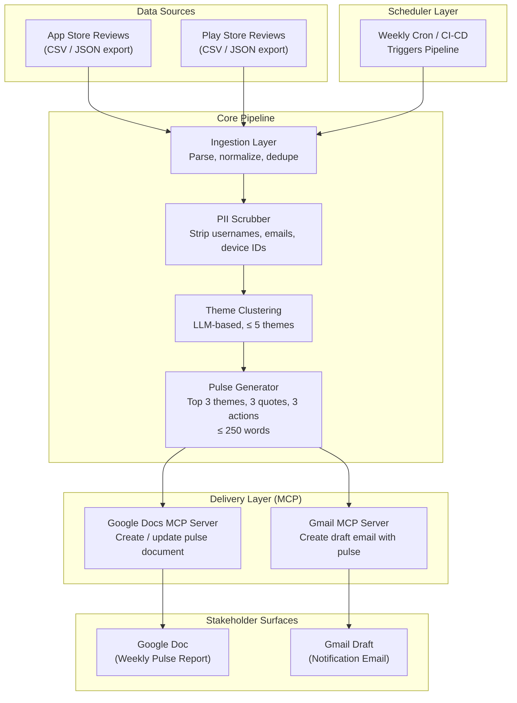
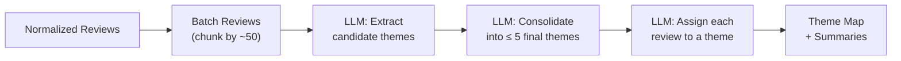
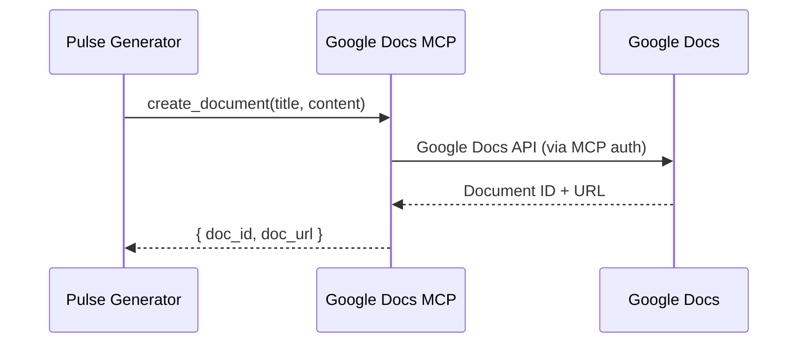
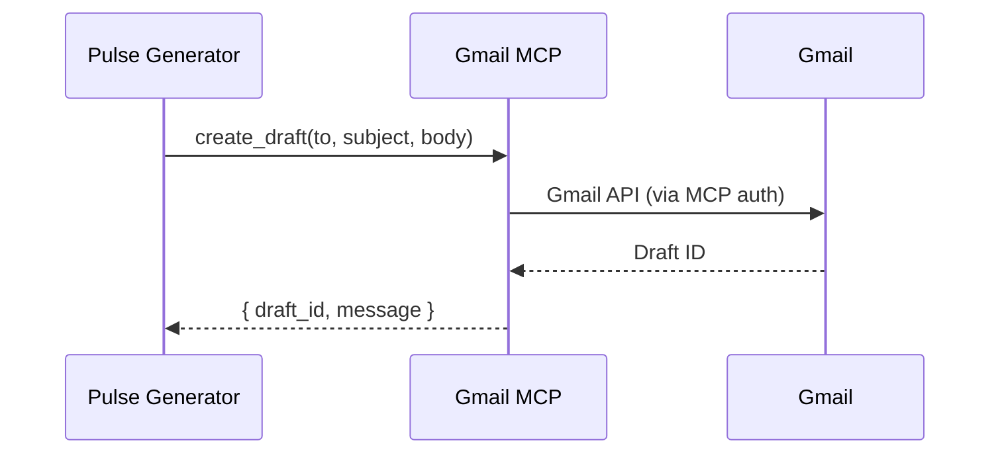
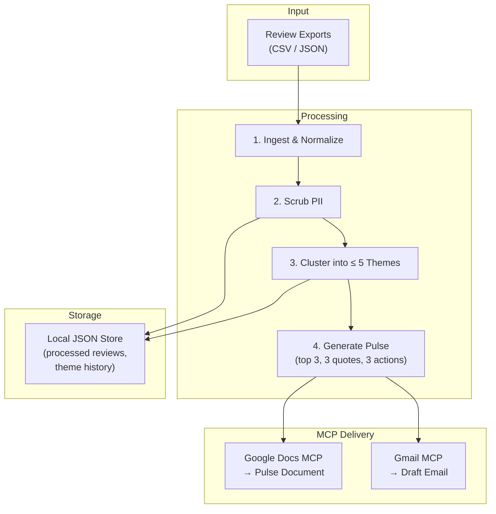
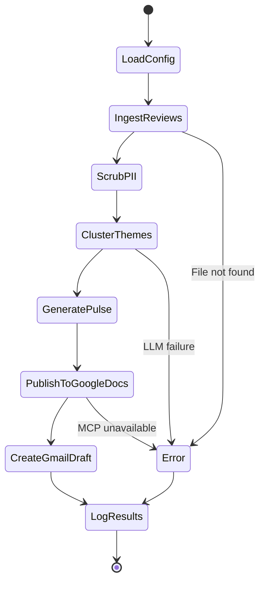

# App Store Review Pulse — Architecture

## 1. System Overview

The **App Store Review Pulse** system is an automated pipeline that ingests public mobile app reviews, clusters them into themes using an LLM, generates a concise weekly pulse report, and delivers it via Google Docs and Gmail — all orchestrated through MCP (Model Context Protocol) servers.

```
┌─────────────────────────────────────────────────────────────────────────┐
│                        Weekly Pulse Pipeline                           │
│                                                                        │
│  ┌──────────┐   ┌──────────────┐   ┌───────────┐   ┌───────────────┐  │
│  │Scheduler │──▶│   Analyze    │──▶│ Generate  │──▶│   Deliver     │  │
│  │ & Ingest │   │  & Cluster   │   │   Pulse   │   │ Docs + Gmail  │  │
│  └──────────┘   └──────────────┘   └───────────┘   └───────────────┘  │
│       │                │                 │                 │            │
│   CSV / JSON      LLM-based         Markdown →        MCP Servers     │
│   public data     theming            formatted          (gdocs,       │
│                   (≤ 5 themes)       one-pager           gmail)       │
└─────────────────────────────────────────────────────────────────────────┘
```

---

## 2. High-Level Architecture Diagram



---

## 3. Component Breakdown

### 3.1 Ingestion Layer

| Aspect         | Details                                                                                                          |
| -------------- | ---------------------------------------------------------------------------------------------------------------- |
| **Purpose**    | Load and normalize raw reviews from public exports.                                                               |
| **Inputs**     | CSV or JSON files exported from App Store Connect / Google Play Console (last 8–12 weeks).                        |
| **Processing** | Parse each review into a unified schema: `{ rating, title, text, date, source (ios/android) }`.                  |
| **Outputs**    | A single normalized list of review records, ready for downstream processing.                                      |
| **Constraints**| Public exports only — no scraping behind store logins or ToS-violating automation.                                |

#### Unified Review Schema

```json
{
  "id": "string (hash-based, deterministic)",
  "source": "app_store | play_store",
  "rating": 1-5,
  "title": "string | null",
  "text": "string",
  "date": "ISO-8601 date",
  "word_count": "integer"
}
```

#### File Structure

```
data/
├── raw/
│   ├── app_store_reviews.csv
│   └── play_store_reviews.csv
└── processed/
    └── normalized_reviews.json
```

---

### 3.2 PII Scrubber

| Aspect         | Details                                                                                                          |
| -------------- | ---------------------------------------------------------------------------------------------------------------- |
| **Purpose**    | Strip all personally identifiable information from reviews before any analysis or output.                         |
| **Targets**    | Usernames, email addresses, device IDs, phone numbers, and any other identifiable reviewer data.                  |
| **Approach**   | Regex-based pattern matching for known PII patterns + LLM pass for ambiguous cases.                              |
| **Placement**  | Runs immediately after ingestion, before reviews enter the clustering pipeline.                                   |

#### PII Patterns Detected

| PII Type       | Detection Method                       | Replacement         |
| -------------- | -------------------------------------- | -------------------- |
| Email          | Regex `\b[\w.]+@[\w.]+\.\w+\b`        | `[EMAIL_REDACTED]`  |
| Phone          | Regex for common phone formats         | `[PHONE_REDACTED]`  |
| Username       | `@mention` pattern                     | `[USER_REDACTED]`   |
| Device ID      | UUID / serial number patterns          | `[ID_REDACTED]`     |
| Named Person   | LLM-assisted NER (fallback)            | `[NAME_REDACTED]`   |

---

### 3.3 Theme Clustering Engine

| Aspect         | Details                                                                                                          |
| -------------- | ---------------------------------------------------------------------------------------------------------------- |
| **Purpose**    | Group reviews into ≤ 5 coherent themes that reflect what users are talking about.                                |
| **Method**     | LLM-based semantic clustering: send batches of reviews to an LLM with instructions to identify recurring themes. |
| **Output**     | A mapping of `{ theme_name → [review_ids] }` plus a `theme_summary` for each cluster.                           |
| **Cap**        | Hard maximum of **5 themes**; the pulse highlights the **top 3** by review volume.                                |

#### Clustering Strategy



**Two-pass approach:**

1. **Theme Discovery** — Send review batches to the LLM asking: _"Identify the top recurring themes across these reviews."_ Merge candidate themes across batches.
2. **Theme Assignment** — Send the finalized theme list back with each review and ask the LLM to classify each review into exactly one theme.

#### Theme Output Schema

```json
{
  "themes": [
    {
      "name": "Payments",
      "summary": "Users report failed transactions and slow refund processing.",
      "review_count": 142,
      "avg_rating": 2.1,
      "representative_quotes": [
        "Payment keeps failing every time I try to add money...",
        "Refund has been pending for 3 weeks now..."
      ]
    }
  ]
}
```

---

### 3.4 Pulse Generator

| Aspect         | Details                                                                                                          |
| -------------- | ---------------------------------------------------------------------------------------------------------------- |
| **Purpose**    | Produce the weekly one-page pulse note from the themed review data.                                              |
| **Inputs**     | Theme map with summaries, review counts, and representative quotes.                                              |
| **Output**     | A formatted pulse document (≤ 250 words) containing top 3 themes, 3 user quotes, and 3 action ideas.            |
| **Format**     | Markdown (for internal use) → converted to Google Docs-compatible format for publishing.                          |

#### Pulse Document Structure

```
┌──────────────────────────────────────────┐
│         📊 Weekly Review Pulse           │
│         Week of [DATE]                   │
├──────────────────────────────────────────┤
│                                          │
│  📌 TOP THEMES                           │
│  1. [Theme A] — brief description        │
│  2. [Theme B] — brief description        │
│  3. [Theme C] — brief description        │
│                                          │
│  💬 USER VOICES                           │
│  • "[verbatim quote 1]" — ★★☆☆☆          │
│  • "[verbatim quote 2]" — ★★★☆☆          │
│  • "[verbatim quote 3]" — ★☆☆☆☆          │
│                                          │
│  🎯 ACTION IDEAS                          │
│  1. [Concrete action tied to Theme A]    │
│  2. [Concrete action tied to Theme B]    │
│  3. [Concrete action tied to Theme C]    │
│                                          │
│  ────────────────────────────────────     │
│  Reviews analyzed: N | Sources: iOS,     │
│  Android | Period: [start] – [end]       │
└──────────────────────────────────────────┘
```

#### Generation Prompt Design

The LLM receives:
- The theme map (top 3 by volume)
- Representative quotes per theme
- Instructions: _"Write a ≤ 250-word weekly pulse. Use only verbatim quotes — never invent wording. Propose 3 concrete actions grounded in the themes."_

---

### 3.5 Delivery Layer (MCP Integrations)

This is the critical integration layer. All interactions with Google Docs and Gmail happen through **MCP servers**, not direct API calls.

#### 3.5.1 Google Docs MCP Server

| Aspect         | Details                                                                                          |
| -------------- | ------------------------------------------------------------------------------------------------ |
| **Purpose**    | Create or update a Google Doc containing the weekly pulse.                                       |
| **MCP Tools**  | `create_document`, `update_document`, `append_text`, etc.                                       |
| **Behavior**   | First run: create a new doc. Subsequent runs: append a new section (weekly log) or replace.      |
| **Output**     | A shareable Google Doc URL for stakeholders.                                                     |



#### 3.5.2 Gmail MCP Server

| Aspect         | Details                                                                                          |
| -------------- | ------------------------------------------------------------------------------------------------ |
| **Purpose**    | Create a draft email containing the pulse note or a link to the Google Doc.                      |
| **MCP Tools**  | `create_draft`, `send_email`, etc.                                                               |
| **Behavior**   | Creates a draft (not auto-sent) addressed to self or an alias.                                   |
| **Content**    | Inline pulse summary + link to the full Google Doc.                                              |



---

### 3.6 Scheduler Component

| Aspect         | Details                                                                                          |
| -------------- | ------------------------------------------------------------------------------------------------ |
| **Purpose**    | Automatically trigger the pulse generation pipeline on a weekly cadence.                         |
| **Approach**   | CI/CD automation (e.g., GitHub Actions) or a lightweight python-based cron daemon.                |
| **Behavior**   | Executes `run_pulse.py` seamlessly without human intervention and notifies on failure.           |

---

## 4. Data Flow Diagram



---

## 5. Project Directory Structure

```
App Store/
├── Docs/
│   ├── ProblemStatement.txt         # Original problem statement
│   ├── ProblemStatement.md          # Formatted problem statement
│   └── Architecture.md             # This document
│
├── data/
│   ├── raw/                         # Raw review exports (CSV/JSON)
│   │   ├── app_store_reviews.csv
│   │   └── play_store_reviews.csv
│   └── processed/                   # Normalized + PII-scrubbed data
│       ├── normalized_reviews.json
│       └── theme_history/           # Historical theme mappings
│           └── 2026-W29.json
│
├── src/
│   ├── __init__.py
│   ├── config.py                    # Central configuration (LLM keys, paths, thresholds)
│   ├── ingest.py                    # Ingestion layer — parse CSV/JSON → unified schema
│   ├── pii_scrubber.py              # PII detection and redaction
│   ├── theme_engine.py              # LLM-based theme clustering (≤ 5 themes)
│   ├── pulse_generator.py           # Pulse note generation (≤ 250 words)
│   ├── delivery.py                  # MCP integration — Google Docs + Gmail
│   └── pipeline.py                  # Orchestrator — runs the full end-to-end pipeline
│
├── mcp_config/
│   └── mcp_servers.json             # MCP server configuration (Docs, Gmail)
│
├── templates/
│   ├── pulse_template.md            # Pulse note template
│   └── email_template.md            # Draft email template
│
├── tests/
│   ├── test_ingest.py
│   ├── test_pii_scrubber.py
│   ├── test_theme_engine.py
│   ├── test_pulse_generator.py
│   └── test_delivery.py
│
├── .env.example                     # Environment variable template
├── requirements.txt                 # Python dependencies
├── README.md                        # Project setup and usage
└── run_pulse.py                     # CLI entry point
```

---

## 6. Technology Stack

| Layer              | Technology                          | Rationale                                                  |
| ------------------ | ----------------------------------- | ---------------------------------------------------------- |
| **Language**       | Python 3.11+                        | Rich ecosystem for data processing and LLM tooling.        |
| **LLM (Analysis)** | Gemini API (or OpenAI-compatible)   | Theme clustering and heavy data analysis.                  |
| **LLM (Generation)**| Groq API                           | Fast, articulate generation of final report and email.     |
| **Data Parsing**   | `pandas` / built-in `csv`+`json`    | Lightweight, no database overhead for weekly batches.       |
| **PII Detection**  | `regex` + LLM fallback              | Fast pattern matching with intelligent edge-case handling.  |
| **MCP Client**     | MCP Python SDK                      | First-class MCP server integration for Docs and Gmail.     |
| **Templating**     | Jinja2 or f-strings                 | Flexible pulse and email formatting.                       |
| **Config**         | `python-dotenv` + `pydantic`        | Type-safe configuration with environment variable support. |
| **Testing**        | `pytest`                            | Unit and integration tests.                                |

---

## 7. Configuration & Environment

### Environment Variables (`.env`)

```env
# LLM (Analysis)
LLM_API_KEY=your-api-key-here
LLM_MODEL=gemini-2.0-flash

# LLM (Generation)
GROQ_API_KEY=your-groq-api-key-here
GROQ_MODEL=llama3-70b-8192

# MCP Servers
MCP_GDOCS_SERVER=gdocs-mcp
MCP_GMAIL_SERVER=gmail-mcp

# Pipeline Settings
REVIEW_WINDOW_WEEKS=8
MAX_THEMES=5
PULSE_TOP_THEMES=3
PULSE_MAX_WORDS=250

# Delivery
PULSE_EMAIL_TO=your-email@example.com
PULSE_DOC_TITLE=Weekly Review Pulse
```

### MCP Server Configuration (`mcp_servers.json`)

```json
{
  "servers": {
    "gdocs": {
      "command": "npx",
      "args": ["-y", "@anthropic/gdocs-mcp-server"],
      "env": {
        "GOOGLE_CREDENTIALS_PATH": "./credentials.json"
      }
    },
    "gmail": {
      "command": "npx",
      "args": ["-y", "@anthropic/gmail-mcp-server"],
      "env": {
        "GOOGLE_CREDENTIALS_PATH": "./credentials.json"
      }
    }
  }
}
```

---

## 8. Pipeline Orchestration

The `pipeline.py` module chains all components into a single run:



### Execution Modes

| Mode            | Command                                   | Behavior                                           |
| --------------- | ----------------------------------------- | -------------------------------------------------- |
| **Full run**    | `python run_pulse.py`                     | End-to-end: ingest → cluster → pulse → deliver.   |
| **Dry run**     | `python run_pulse.py --dry-run`           | Generate pulse locally; skip MCP delivery.          |
| **Ingest only** | `python run_pulse.py --step ingest`       | Just parse and normalize reviews.                   |
| **Deliver only**| `python run_pulse.py --step deliver`      | Re-deliver last generated pulse via MCP.            |

---

## 9. Error Handling & Resilience

| Failure Point           | Handling Strategy                                                                    |
| ----------------------- | ------------------------------------------------------------------------------------ |
| Missing review files    | Log warning, abort with clear message listing expected file paths.                   |
| LLM API timeout/error   | Retry up to 3 times with exponential backoff (2s, 4s, 8s). Fail gracefully.         |
| LLM returns > 5 themes  | Post-process: merge lowest-volume themes into an "Other" bucket.                     |
| Pulse exceeds 250 words | Re-prompt LLM with stricter constraint; truncate as last resort.                     |
| MCP server unreachable  | Log error, save pulse locally as fallback, notify user via console.                  |
| PII leaks through       | Defense in depth: regex pass + LLM review. Log warnings for manual audit.            |

---

## 10. Security & Privacy

| Concern              | Mitigation                                                                         |
| -------------------- | ---------------------------------------------------------------------------------- |
| **PII in reviews**   | Mandatory scrubbing before any analysis; no PII in theme maps, pulse, or email.    |
| **API keys**         | Stored in `.env`, never committed to version control (`.gitignore`).               |
| **MCP credentials**  | Handled by MCP servers — the pipeline never touches OAuth tokens directly.         |
| **Data retention**   | Raw review files are local-only; processed data is ephemeral per run by default.   |
| **Audit trail**      | Every pipeline run logs: timestamp, review count, themes found, delivery status.   |

---

## 11. Future Enhancements

| Enhancement                     | Description                                                            | Priority  |
| ------------------------------- | ---------------------------------------------------------------------- | --------- |
| **Trend tracking**              | Compare themes week-over-week; highlight emerging and declining topics.| High      |
| **Sentiment scoring**           | Attach sentiment polarity to each theme beyond star ratings.           | Medium    |
| **Slack / Teams delivery**      | Add MCP server for Slack/Teams as an additional delivery channel.      | Medium    |
| **Dashboard UI**                | Simple web dashboard for interactive exploration of themes over time.  | Low       |
| **Multi-app support**           | Process reviews for multiple apps in a single pipeline run.            | Low       |
