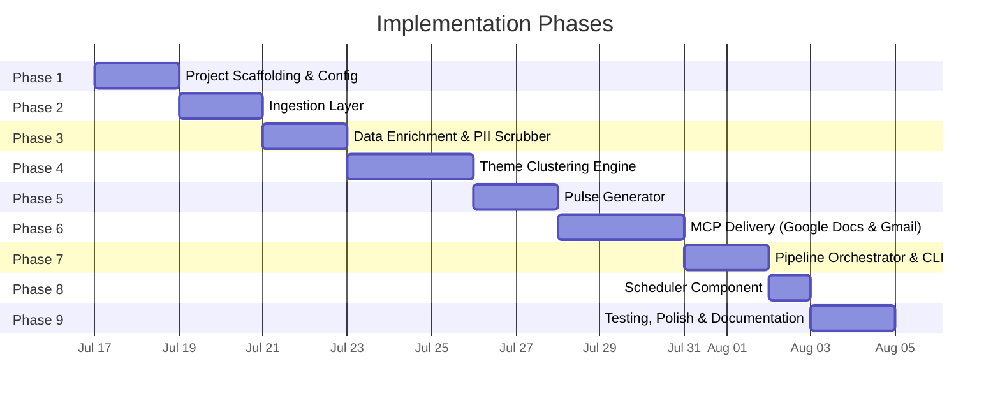
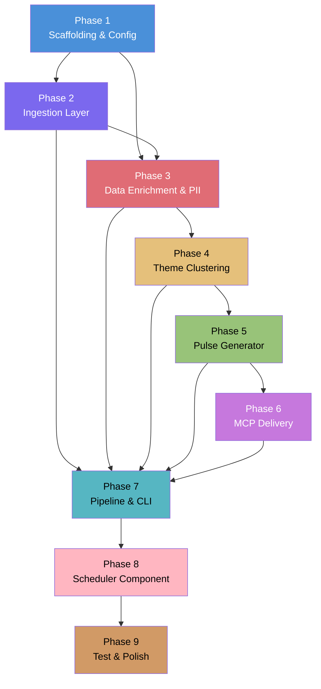

# App Store Review Pulse — Phase-Wise Implementation Plan

## Document Context

| Reference                | Link                                                                                      |
| ------------------------ | ----------------------------------------------------------------------------------------- |
| **Problem Statement**    | [ProblemStatement.md](file:///Users/bhawna/Desktop/App%20Store/Docs/ProblemStatement.md)   |
| **Architecture**         | [Architecture.md](file:///Users/bhawna/Desktop/App%20Store/Docs/Architecture.md)          |

---

## Phase Overview



```
Phase 1 → Phase 2 → Phase 3 → Phase 4 → Phase 5 → Phase 6 → Phase 7 → Phase 8 → Phase 9
Scaffold   Ingest     Enrich &   Theme      Pulse     MCP        CLI &      Scheduler  Test &
& Config              Scrub      Cluster    Generate  Deliver    Pipeline   Automate  Polish
```

---

## Phase 1: Project Scaffolding & Configuration

### Goal
Stand up the project skeleton, install dependencies, and wire up configuration so every subsequent phase has a working foundation.

### Tasks

- [ ] **1.1** Create the full directory structure:
  ```
  App Store/
  ├── src/
  │   └── __init__.py
  ├── data/
  │   ├── raw/
  │   └── processed/
  │       └── theme_history/
  ├── templates/
  ├── mcp_config/
  ├── tests/
  └── Docs/
  ```

- [ ] **1.2** Create `requirements.txt` with all dependencies:
  ```
  google-genai>=1.0.0
  pandas>=2.1.0
  python-dotenv>=1.0.0
  pydantic>=2.0.0
  pydantic-settings>=2.0.0
  jinja2>=3.1.0
  mcp>=1.0.0
  pytest>=7.4.0
  groq>=0.9.0
  ```

- [ ] **1.3** Create `.env.example` with all environment variable placeholders:
  ```env
  LLM_API_KEY=
  LLM_MODEL=gemini-2.0-flash
  GROQ_API_KEY=
  GROQ_MODEL=llama3-70b-8192
  REVIEW_WINDOW_WEEKS=8
  MAX_THEMES=5
  PULSE_TOP_THEMES=3
  PULSE_MAX_WORDS=250
  PULSE_EMAIL_TO=
  PULSE_DOC_TITLE=Weekly Review Pulse
  ```

- [ ] **1.4** Implement `src/config.py` using Pydantic Settings:
  - Load `.env` via `python-dotenv`
  - Define a `Settings` class with typed fields and defaults for every config value
  - Expose a singleton `get_settings()` function
  - Include path constants for `data/raw/`, `data/processed/`, `templates/`

- [ ] **1.5** Create `.gitignore` excluding `.env`, `data/raw/`, `__pycache__/`, `.pytest_cache/`

- [ ] **1.6** Create `mcp_config/mcp_servers.json` with placeholder configs for Google Docs and Gmail MCP servers

### Deliverables
| Artifact                     | Description                               |
| ---------------------------- | ----------------------------------------- |
| `requirements.txt`           | Pinned Python dependencies                |
| `.env.example`               | Template for environment variables        |
| `src/config.py`              | Centralized, type-safe configuration      |
| `mcp_config/mcp_servers.json`| MCP server connection definitions         |
| `.gitignore`                 | Version control exclusions                |

### Verification
- [ ] `pip install -r requirements.txt` completes without errors
- [ ] `python -c "from src.config import get_settings; print(get_settings())"` prints the loaded config

---

## Phase 2: Ingestion Layer

### Goal
Parse raw CSV/JSON review exports into a unified, normalized format ready for downstream processing.

### Tasks

- [ ] **2.1** Implement `src/ingest.py` with the following:

  - **`load_app_store_reviews(filepath) → list[Review]`**
    - Parse Apple CSV export (typical columns: `Title`, `Body`, `Rating`, `Date`, etc.)
    - Map to the unified `Review` schema
    - Handle encoding issues (UTF-8 BOM, special characters)

  - **`load_play_store_reviews(filepath) → list[Review]`**
    - Parse Google Play CSV export (typical columns: `Star Rating`, `Review Text`, `Review Submit Date and Time`, etc.)
    - Map to the unified `Review` schema

  - **`normalize_reviews(reviews) → list[Review]`**
    - Deduplicate by deterministic hash of `(source, text, date)`
    - Filter out empty/blank review text
    - Filter out reviews with less than 8 words
    - Filter out reviews containing emojis
    - Filter out reviews in the Hindi language
    - Compute `word_count` for each review
    - Sort by date descending

  - **`save_normalized(reviews, output_path)`**
    - Write the normalized review list to `data/processed/normalized_reviews.json`

- [ ] **2.2** Define the `Review` data model (Pydantic):
  ```python
  class Review(BaseModel):
      id: str              # Deterministic hash
      source: Literal["app_store", "play_store"]
      rating: int          # 1–5
      title: str | None
      text: str
      date: date
      word_count: int
  ```

- [ ] **2.3** Add sample review data for development/testing:
  - Create `data/raw/sample_app_store_reviews.csv` (~20 rows)
  - Create `data/raw/sample_play_store_reviews.csv` (~20 rows)

- [ ] **2.4** Write `tests/test_ingest.py`:
  - Test CSV parsing for both App Store and Play Store formats
  - Test deduplication logic
  - Test empty/malformed row handling
  - Test deterministic ID generation

### Deliverables
| Artifact                          | Description                                    |
| --------------------------------- | ---------------------------------------------- |
| `src/ingest.py`                   | Ingestion + normalization module               |
| `data/raw/sample_*.csv`          | Sample review data for testing                 |
| `tests/test_ingest.py`           | Unit tests for ingestion                       |

### Verification
- [ ] `pytest tests/test_ingest.py` — all tests pass
- [ ] Running ingestion on sample data produces a valid `normalized_reviews.json` with correct schema

---

## Phase 3: Data Enrichment & PII Scrubber

### Goal
Ensure no personally identifiable information survives past the ingestion boundary, and enrich the raw reviews with granular analytical metadata (sentiment, feature tags, actionability) to empower the downstream theme clustering engine.

### Tasks

- [x] **3.1** Implement `src/pii_scrubber.py`:
  - **`scrub_text(text: str) → str`**
    - Apply regex patterns sequentially for known India-specific PII types:
      | Pattern           | Regex (Targeting Indian Context)           | Replacement         |
      | ----------------- | ------------------------------------------ | -------------------- |
      | Email             | `\b[\w.+-]+@[\w-]+\.[\w.]+\b`              | `[EMAIL_REDACTED]`  |
      | UPI IDs           | `[a-zA-Z0-9.\-_]{2,256}@[a-zA-Z]{2,64}` (e.g., `@ybl`, `@paytm`) | `[UPI_REDACTED]` |
      | Phone             | Indian formats (`(?:\+91[- ]?)?[6-9]\d{9}`) | `[PHONE_REDACTED]`  |
      | PAN Number        | `\b[A-Z]{5}[0-9]{4}[A-Z]{1}\b`             | `[PAN_REDACTED]`    |
      | Aadhar Number     | `\b\d{4}[\s-]?\d{4}[\s-]?\d{4}\b`          | `[AADHAR_REDACTED]` |
      | @mentions         | `@\w+` (excluding valid UPI domains)       | `[USER_REDACTED]`   |
      | URLs with user IDs| URL patterns containing user-specific paths| `[URL_REDACTED]`    |
      | UUIDs / Device IDs| UUID v4 pattern + serial patterns          | `[ID_REDACTED]`     |

- [ ] **3.2** Implement `src/analyzer.py` (Data Enrichment Strategy):
  - **`enrich_review(review: Review) → EnrichedReview`**
    - Process the scrubbed text to attach analytical metadata:
    - **Sentiment Scoring:** Compute a continuous sentiment score (-1.0 to 1.0) using a lightweight NLP library (e.g., `TextBlob` or `vaderSentiment`) to detect emotion beyond the 1-5 star rating.
    - **Feature Tagging:** Map keywords to product domains (e.g., `F&O`, `Mutual Funds`, `IPO`, `Brokerage/Charges`, `UI/UX`, `Customer Support`).
    - **Actionability Flag:** Flag reviews that contain specific actionable keywords (e.g., "add", "fix", "failed", "error", "charge") vs generic noise (e.g., "nice app").

- [ ] **3.3** Update Data Models in `src/ingest.py` or create new:
  ```python
  class EnrichedReview(Review):
      sentiment_score: float
      sentiment_label: Literal["Positive", "Neutral", "Negative"]
      feature_tags: list[str]
      is_actionable: bool
  ```

- [x] **3.4** Write `tests/test_pii_scrubber.py` and `tests/test_analyzer.py`:
  - Test PII patterns (positive/negative examples).
  - Test sentiment edge cases (e.g., 5-star rating but negative text).
  - Test keyword extraction for feature tags.

### Deliverables
| Artifact                          | Description                                    |
| --------------------------------- | ---------------------------------------------- |
| `src/pii_scrubber.py`            | PII detection and redaction module             |
| `src/analyzer.py`                | Data enrichment and analysis strategy          |
| `tests/test_*.py`                | Unit tests for scrubbing and analysis          |

### Verification
- [x] PII Scrubbing tests pass and manual spot-checks confirm 100% redaction.
- [ ] Analyzer successfully tags domains and computes sentiment for the normalized dataset.

---

## Phase 4: Theme Clustering Engine

### Goal
Use an LLM to discover up to 5 themes from the review corpus and assign every review to exactly one theme.

### Tasks

- [x] **4.1** Implement `src/theme_engine.py`:

  - **`discover_themes(reviews: list[Review], max_themes: int = 5) → list[Theme]`**
    - Leverage large context windows (e.g., Gemini Flash): Pass all reviews (or large batches of 500-1000) in a single prompt to avoid the messy consolidation step.
    - Explicitly instruct the LLM to understand **Hinglish (Roman Hindi)** and Indian fintech jargon (e.g., F&O, Brokerage, Demat, MTF).
    - Prompt the LLM:
      > _"Given these app reviews, identify the top recurring themes. Return a JSON array of theme objects with `name` and `description` fields. Maximum {max_themes} themes. Include a 'Noise/Junk' theme for gibberish or unrelated reviews."_
    - Return ≤ 5 final themes (plus the Noise theme).

  - **`assign_reviews_to_themes(reviews: list[Review], themes: list[Theme]) → ThemeMap`**
    - Batch reviews into chunks of 100-200 (to respect LLM output token limits).
    - For each batch, prompt the LLM:
      > _"Classify each of these reviews into exactly one of the following themes: [theme list]. Return a JSON array mapping `review_id` to `theme_name`."_
    - Build the mapping: `{ theme_name → [review_ids] }`

  - **`build_theme_summary(theme_map: ThemeMap, reviews: list[Review]) → list[ThemeSummary]`**
    - For each theme (excluding the 'Noise/Junk' theme), compute:
      - `review_count`
      - `avg_rating` (mean of assigned reviews)
      - `representative_quotes` (top 3 by relevance, selected by LLM—preferably well-articulated English/Hinglish quotes)
    - Sort themes by `review_count` descending

- [x] **4.2** Define data models:
  ```python
  class Theme(BaseModel):
      name: str
      description: str

  class ThemeSummary(BaseModel):
      name: str
      summary: str
      review_count: int
      avg_rating: float
      representative_quotes: list[str]  # Max 3
  ```

- [x] **4.3** Implement LLM client helper in `src/llm_client.py`:
  - Wrapper around Gemini / OpenAI-compatible API
  - Handles retries (3x with exponential backoff: 2s, 4s, 8s)
  - JSON response parsing with validation
  - Token usage logging

- [x] **4.4** Design and store prompts:
  - Create `templates/prompts/theme_discovery.txt`
  - Create `templates/prompts/theme_assignment.txt`
  - Create `templates/prompts/quote_selection.txt`

- [x] **4.5** Save theme results to `data/processed/theme_history/{week}.json` for future trend tracking

- [x] **4.6** Write `tests/test_theme_engine.py`:
  - Test with mocked LLM responses
  - Test theme count cap enforcement (≤ 5)
  - Test review assignment coverage (every review assigned)
  - Test theme summary computation (counts, averages)

### Deliverables
| Artifact                                | Description                                      |
| --------------------------------------- | ------------------------------------------------ |
| `src/theme_engine.py`                   | Theme discovery + assignment module              |
| `src/llm_client.py`                     | Reusable LLM API client with retries             |
| `templates/prompts/*.txt`               | Versioned prompt templates                       |
| `tests/test_theme_engine.py`            | Unit tests (mocked LLM)                          |

### Verification
- [x] `pytest tests/test_theme_engine.py` — all mocked tests pass
- [x] Live test: run against sample data with real LLM → verify ≤ 5 themes returned, all reviews assigned
- [x] Inspect `data/processed/theme_history/` for saved output

---

## Phase 5: Pulse Generator

### Goal
Produce the formatted weekly one-page pulse note (≤ 250 words) from themed review data.

### Tasks

- [x] **5.1** Implement `src/pulse_generator.py`:

  - **`generate_pulse(theme_summaries: list[ThemeSummary], settings: Settings) → PulseReport`**
    - Select top 3 themes by `review_count`
    - Select 3 representative quotes (1 per top theme, from `representative_quotes`)
    - Initialize the `LLMClient` (built in Phase 4) to abstract provider details
    - Prompt the LLM to generate 3 actionable ideas grounded in the themes, with context for Indian fintech:
      > _"You are a Product Manager for an Indian fintech app. Based on these top 3 user feedback themes, suggest 3 concrete, actionable product improvements. Keep each action to one sentence in professional English, even if the user quotes contain Hinglish or local jargon (like F&O, MTF)."_
    - Assemble the pulse note using the Jinja2 template
    - Validate word count ≤ 250; if exceeded, re-prompt with stricter constraint

  - **`format_pulse_markdown(pulse: PulseReport) → str`**
    - Render the pulse as Markdown using `templates/pulse_template.md`

  - **`format_pulse_email(pulse: PulseReport, doc_url: str | None) → str`**
    - Render the email body using `templates/email_template.md`
    - Include inline pulse summary + Google Doc link (if available)

- [x] **5.2** Define the `PulseReport` model:
  ```python
  class PulseReport(BaseModel):
      week_label: str                    # e.g., "Week of July 14, 2026"
      period_start: date
      period_end: date
      total_reviews: int
      sources: list[str]                 # ["App Store", "Play Store"]
      top_themes: list[PulseTheme]       # Exactly 3
      user_quotes: list[PulseQuote]      # Exactly 3
      action_ideas: list[str]            # Exactly 3
      word_count: int
  ```

- [x] **5.3** Create Jinja2 templates:

  - **`templates/pulse_template.md`**
    ```
    # 📊 Weekly Review Pulse
    ## {{ week_label }}

    ### 📌 Top Themes
    
    {{ loop.index }}. **{{ theme.name }}** — {{ theme.summary }}
    

    ### 💬 User Voices
    
    - "{{ quote.text }}" — {{ quote.rating_stars }}
    

    ### 🎯 Action Ideas
    
    {{ loop.index }}. {{ action }}
    

    ---
    _Reviews analyzed: {{ total_reviews }} | Sources: {{ sources | join(", ") }} | Period: {{ period_start }} – {{ period_end }}_
    ```

  - **`templates/email_template.md`**
    - Subject line: `📊 Weekly Review Pulse — {{ week_label }}`
    - Body: Inline pulse + "View full report" link to Google Doc

- [x] **5.4** Write `tests/test_pulse_generator.py`:
  - Test with mock theme summaries → verify output structure
  - Test word count enforcement (≤ 250)
  - Test that exactly 3 themes, 3 quotes, 3 actions are produced
  - Test Markdown rendering against expected output

### Deliverables
| Artifact                          | Description                                    |
| --------------------------------- | ---------------------------------------------- |
| `src/pulse_generator.py`         | Pulse generation module (uses Groq API)        |
| `templates/pulse_template.md`    | Pulse Markdown template                        |
| `templates/email_template.md`    | Email body template                            |
| `tests/test_pulse_generator.py`  | Unit tests for pulse generation                |

### Verification
- [x] `pytest tests/test_pulse_generator.py` — all tests pass
- [x] Live test: generate pulse from Phase 4 output → visually inspect the Markdown for correctness
- [x] Word count check: confirm output ≤ 250 words

---

## Phase 6: MCP Delivery (Google Docs & Gmail)

### Goal
Integrate with Google Docs and Gmail through MCP servers to publish the pulse and create a draft email.

### Tasks

- [ ] **6.1** Configure unified MCP server:
  - Utilize the provided MCP server at `https://mcp-server-1-igzm.onrender.com/sse` (GitHub: `https://github.com/duskydaydreamer/mcp-server-1`) which handles both Google Docs and Gmail integrations.
  - Document the specific tool interfaces exposed by this server for creating documents and email drafts.

- [ ] **6.2** Set up MCP authentication (if required by the server):
  - Configure necessary credentials (e.g., Google OAuth2 `credentials.json` or API keys) as expected by the remote server.
  - Complete the initial auth flow for both Docs and Gmail scopes.
  - Store tokens securely.

- [ ] **6.3** Implement `src/delivery.py`:

  - **`publish_to_google_docs(pulse_md: str, settings: Settings) → DocResult`**
    - Connect to the unified MCP server via SSE transport.
    - Call the relevant document creation tool with the pulse content.
    - Return `DocResult(doc_id, doc_url)`.
    - Handle MCP connection errors with retry + local fallback.

  - **`create_gmail_draft(email_body: str, settings: Settings, doc_url: str | None) → DraftResult`**
    - Connect to the unified MCP server via SSE transport.
    - Create a draft email:
      - **To**: `settings.pulse_email_to`
      - **Subject**: `📊 Weekly Review Pulse — {week_label}`
      - **Body**: Inline pulse + Google Doc link
    - Return `DraftResult(draft_id, message)`
    - Handle MCP connection errors gracefully

  - **`deliver(pulse: PulseReport, pulse_md: str, email_body: str, settings: Settings) → DeliveryResult`**
    - Orchestrate: publish doc → get URL → create draft with URL
    - If Docs fails, still create draft with inline-only content
    - Log all delivery results

- [ ] **6.4** Define delivery models:
  ```python
  class DocResult(BaseModel):
      doc_id: str
      doc_url: str
      status: Literal["created", "updated", "failed"]

  class DraftResult(BaseModel):
      draft_id: str
      message: str
      status: Literal["created", "failed"]

  class DeliveryResult(BaseModel):
      doc: DocResult | None
      draft: DraftResult | None
      fallback_used: bool
  ```

- [ ] **6.5** Update `mcp_config/mcp_servers.json` with finalized server configs

- [ ] **6.6** Write `tests/test_delivery.py`:
  - Test with mocked MCP server responses
  - Test Google Docs publish flow (create + update)
  - Test Gmail draft creation
  - Test fallback behavior when MCP is unavailable
  - Test orchestration (doc URL passed to email draft)

### Deliverables
| Artifact                          | Description                                    |
| --------------------------------- | ---------------------------------------------- |
| `src/delivery.py`                | MCP integration for Docs + Gmail               |
| `mcp_config/mcp_servers.json`    | Finalized MCP server configurations            |
| `tests/test_delivery.py`        | Unit tests for delivery (mocked MCP)           |

### Verification
- [ ] `pytest tests/test_delivery.py` — all mocked tests pass
- [ ] Live test: publish a test pulse to Google Docs → verify document created and accessible via URL
- [ ] Live test: create a Gmail draft → verify draft appears in Gmail Drafts folder
- [ ] Test fallback: disconnect MCP → verify pulse is saved locally and error is logged

---

## Phase 7: Pipeline Orchestrator & CLI

### Goal
Wire all components into a single orchestrated pipeline with a CLI entry point supporting full runs, dry runs, and step-wise execution.

### Tasks

- [ ] **7.1** Implement `src/pipeline.py`:

  - **`run_pipeline(settings: Settings, dry_run: bool = False, step: str | None = None)`**
    - Chain execution:
      1. `ingest` → Load and normalize reviews
      2. `scrub` → Remove PII from normalized reviews
      3. `cluster` → Run theme discovery + assignment
      4. `generate` → Produce pulse report
      5. `deliver` → Publish to Google Docs + create Gmail draft (skip if `dry_run`)
    - Log each step's start/end time and result
    - If `step` is specified, run only that step (loading prior state from `data/processed/`)
    - Save intermediate outputs after each step for resumability

  - **`PipelineResult`** model:
    ```python
    class PipelineResult(BaseModel):
        timestamp: datetime
        reviews_loaded: int
        reviews_after_scrub: int
        themes_found: int
        pulse_word_count: int
        delivery: DeliveryResult | None
        errors: list[str]
        duration_seconds: float
    ```

- [ ] **7.2** Implement `run_pulse.py` (CLI entry point):
  ```
  Usage: python run_pulse.py [OPTIONS]

  Options:
    --dry-run           Generate pulse locally; skip MCP delivery
    --step STEP         Run a single step: ingest | scrub | cluster | generate | deliver
    --config PATH       Path to .env file (default: .env)
    --verbose           Enable debug logging
    --help              Show this help message
  ```
  - Use `argparse` for CLI argument parsing
  - Load settings, call `run_pipeline()`, print summary to console

- [ ] **7.3** Add structured logging:
  - Configure Python `logging` with formatted output
  - Log pipeline start/end, step transitions, review counts, theme names, delivery status
  - Write run logs to `data/processed/run_log.jsonl` (append-only)

- [ ] **7.4** Implement graceful error handling:
  - Wrap each pipeline step in try/except
  - On failure: log error, save partial results, continue to next step where possible
  - On critical failure (e.g., no reviews loaded): abort with clear message

- [ ] **7.5** Write `tests/test_pipeline.py`:
  - Test full pipeline with all components mocked
  - Test dry-run mode (delivery not called)
  - Test step-wise execution
  - Test error propagation and recovery

### Deliverables
| Artifact                          | Description                                    |
| --------------------------------- | ---------------------------------------------- |
| `src/pipeline.py`                | Pipeline orchestrator                          |
| `run_pulse.py`                   | CLI entry point                                |
| `tests/test_pipeline.py`        | Integration tests for pipeline                 |

### Verification
- [ ] `python run_pulse.py --help` — prints usage information
- [ ] `python run_pulse.py --dry-run` — runs full pipeline, generates local pulse, no MCP calls
- [ ] `python run_pulse.py --step ingest` — runs only ingestion
- [ ] `pytest tests/test_pipeline.py` — all tests pass
- [ ] Check `data/processed/run_log.jsonl` for structured log entries

---

## Phase 8: Scheduler Component

### Goal
Automate the pipeline to run on a recurring weekly schedule using GitHub Actions, ensuring stakeholders receive fresh data without manual intervention.

### Tasks

- [ ] **8.1** Implement the Scheduler trigger:
  - Create `.github/workflows/weekly_pulse.yml` to trigger `python run_pulse.py` every Monday at 9 AM.
- [ ] **8.2** Configure Environment/Secrets Documentation:
  - Update `README.md` to document the necessary GitHub Repository Secrets required for the action to run successfully.

### Deliverables
| Artifact                          | Description                                    |
| --------------------------------- | ---------------------------------------------- |
| Scheduler Config                  | CI/CD workflow file (`.github/workflows/weekly_pulse.yml`) |

### Verification
- [ ] Manual test of the trigger verifies the pipeline executes properly.
- [ ] Schedule successfully executes autonomously at the designated time.

---

## Phase 9: Testing, Polish & Documentation

### Goal
Ensure production readiness with comprehensive testing, code quality, and user-facing documentation.

### Tasks

- [ ] **9.1** End-to-end integration test:
  - Run the full pipeline against real review data (sample or actual)
  - Verify: reviews ingested → PII scrubbed → themes clustered → pulse generated → Google Doc created → Gmail draft created
  - Capture and document the full run output

- [ ] **9.2** Edge case testing:
  - Empty review file (0 reviews)
  - Single review
  - Reviews with heavy PII
  - All reviews with same rating (no variance)
  - Non-English reviews
  - Very long reviews (>1000 words)

- [ ] **9.3** Code quality:
  - Add docstrings to all public functions
  - Add type hints throughout
  - Run `mypy` for type checking (optional)
  - Ensure consistent code formatting

- [ ] **9.4** Create `README.md`:
  ```markdown
  # App Store Review Pulse

  ## Overview
  ## Quick Start
  ### Prerequisites
  ### Installation
  ### Configuration
  ### Running the Pipeline
  ## Project Structure
  ## Architecture
  ## Contributing
  ```

- [ ] **9.5** Final documentation:
  - Update `Docs/Architecture.md` with any changes discovered during implementation
  - Add a `CHANGELOG.md` documenting what was built
  - Ensure all prompts in `templates/prompts/` are documented

- [ ] **9.6** Demo run:
  - Execute a complete pipeline run with real data
  - Screenshot the Google Doc output
  - Screenshot the Gmail draft
  - Document the results in a demo report

### Deliverables
| Artifact                          | Description                                    |
| --------------------------------- | ---------------------------------------------- |
| `README.md`                      | Project setup and usage guide                  |
| `CHANGELOG.md`                   | Build history                                  |
| End-to-end test results          | Documented proof of working pipeline           |
| Demo screenshots                 | Visual proof of Google Doc + Gmail delivery    |

### Verification
- [ ] `pytest` — full test suite passes (all phases)
- [ ] `python run_pulse.py` — end-to-end run completes successfully
- [ ] Google Doc is created and accessible
- [ ] Gmail draft is created and visible in Drafts
- [ ] README is accurate and a new developer can set up the project following it

---

## Phase Dependency Graph



> **Note:** Phases 2 and 3 share a dependency on Phase 1 and can be partially parallelized. However, Phase 3 requires Phase 2's `Review` model, so full parallel execution is limited. Phase 7 depends on all core components (Phases 2–6) being complete.

---

## Risk Register

| Risk                                        | Likelihood | Impact | Mitigation                                                                                |
| ------------------------------------------- | ---------- | ------ | ----------------------------------------------------------------------------------------- |
| MCP servers for Docs/Gmail not available     | Medium     | High   | Research in Phase 6.1 first; fallback to direct API as last resort with user approval.    |
| LLM produces inconsistent theme outputs     | Medium     | Medium | Structured JSON prompting + validation layer; retry on malformed output.                  |
| Review export formats vary across versions  | Low        | Medium | Build flexible parsers with column mapping config; test with multiple export samples.     |
| PII slips through regex patterns            | Low        | High   | Defense in depth: regex + LLM review; manual audit of first 5 runs.                      |
| Pulse word count hard to control            | Low        | Low    | Re-prompt strategy + truncation fallback; accept ±10% tolerance.                          |
| Google OAuth token expiry during runs       | Low        | Medium | MCP servers handle refresh; document manual re-auth steps in README.                      |

---

## Success Criteria

The project is **complete** when all of the following are true:

| #  | Criterion                                                                                   | Phase |
| -- | ------------------------------------------------------------------------------------------- | ----- |
| 1  | Raw reviews from App Store and Play Store are parsed into a unified schema                  | 2     |
| 2  | All PII is stripped before any analysis or output                                            | 3     |
| 3  | Reviews are clustered into ≤ 5 themes with summaries and representative quotes              | 4     |
| 4  | A ≤ 250-word pulse note is generated with top 3 themes, 3 quotes, and 3 action ideas        | 5     |
| 5  | The pulse is published to a Google Doc via MCP                                               | 6     |
| 6  | A draft email with the pulse is created in Gmail via MCP                                     | 6     |
| 7  | The full pipeline runs end-to-end via a single CLI command                                   | 7     |
| 8  | A scheduler is configured to trigger the pipeline automatically on a weekly cadence          | 8     |
| 9  | All unit and integration tests pass                                                          | 9     |
